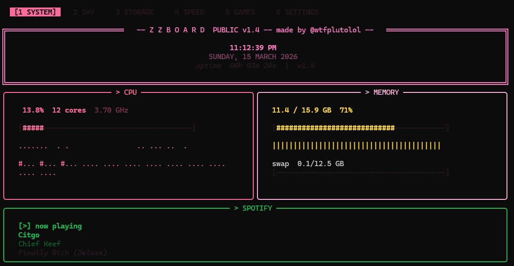
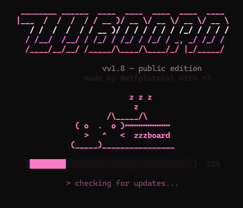

# ZZBoard Public

> A beautiful, feature-rich terminal dashboard. Free, open source, and made for everyone.

```
  ________ ______  ____  ____  ____  ____  ____
 |___  /  /  /  / / __ )/ __ \/ __ \/ __ \/ __ \
    / /  /  /  / / __ )/ / / / / / / /_/ / / / /
   / /__/  /__/ / /_/ / /_/ / /_/ / _, _/ /_/ /
  /____/__/__/ /_____/\____/\____/_/ |_/_____/
         PUBLIC EDITION  -- made by @wtfplutolol with <3
```

---

## What it looks like

### System tab — CPU, Memory and Spotify now playing


### Boot screen — animated sleeping cat with update checker


---

## Features

- **6 tabbed screens** — press `1` through `6` to switch instantly
- **Live system stats** — CPU, RAM, disk, network with sparkline graphs and per-core bars
- **Weather** — asks for your city on first launch, auto-detects if multiple cities share a name
- **Moon phase** — real-time ASCII moon art, illumination %, and days to full moon
- **Sunrise & sunset** — fetched automatically based on your city
- **Spotify now playing** — enter your own API keys in Settings, stored locally
- **Speed test** — download, upload and ping, runs automatically on a timer
- **Mini games** — Snake and Flappy Bird with high score tracking
- **5 color themes** — green, blue, pink, amber, red, switchable live in settings
- **Advanced settings** — Spotify keys, city reset, time format, speed interval
- **Auto-updater** — checks GitHub Releases on every launch and updates the exe silently
- **Animated boot screen** — sleeping cat with progress bar and live update log

---

## Tabs

| Key | Tab | Contents |
|-----|-----|----------|
| `1` | System | Clock, CPU, Memory, Spotify (if configured) |
| `2` | Sky | Weather + Moon Phase + Sunrise/Sunset |
| `3` | Storage | Disk usage, Tasks, Top Processes |
| `4` | Speed | Internet speed test |
| `5` | Games | Snake + Flappy Bird with high scores |
| `6` | Settings | Theme, temp unit, time format, city reset, Spotify keys |

---

## Controls

| Key | Action |
|-----|--------|
| `1` - `6` | Switch tabs |
| `S` | Start / restart Snake |
| `F` | Start / restart Flappy Bird |
| `WASD` / Arrow keys | Move in Snake |
| `Space` | Flap in Flappy Bird |
| `Q` | Quit current game |
| Arrow keys | Navigate settings |
| `Left` / `Right` | Change setting value |
| `Enter` | Confirm setting / action |
| `Ctrl+C` | Exit ZZBoard |

---

## Installation

### Easy way — Windows exe (no Python needed)

1. Go to [Releases](../../releases/latest) and download `zzboard_public.exe`
2. Double-click to run
3. On first launch it asks for your city — just type it and hit Enter
4. That's it!

### Developer way — Python

**Requirements:** Python 3.10+

```bash
pip install psutil rich requests speedtest-cli watchdog spotipy
python zzboard_public.py
```

---

## Setting up Spotify

1. Go to [developer.spotify.com/dashboard](https://developer.spotify.com/dashboard)
2. Create a free app — set Redirect URI to `http://127.0.0.1:8888/callback`
3. Copy your **Client ID** and **Client Secret**
4. In ZZBoard press `6` for Settings → scroll down to **Advanced**
5. Enter your Client ID and Secret — saved locally, never uploaded
6. Restart ZZBoard — Spotify now playing appears at the bottom of Tab 1

---

## Configuration

On first launch ZZBoard creates `zzboard_config.json` next to the exe:

```json
{
  "city": "London",
  "city_state": "England",
  "city_country": "GB",
  "theme": "pink",
  "temp_unit": "F",
  "time_format": "24",
  "speed_interval": 30,
  "tasks": ["Review pull requests", "Update dependencies", "Write docs"],
  "spotify_client_id": "",
  "spotify_client_secret": ""
}
```

High scores are saved to `zzboard_scores.json`.

---

## Themes

| Name | Color |
|------|-------|
| `pink` | Hot pink (default) |
| `green` | Neon mint |
| `blue` | Sky blue |
| `amber` | Warm gold |
| `red` | Bright red |

Switch themes live in Settings tab — no restart needed.

---

## Auto-updates

ZZBoard checks GitHub Releases on every launch. If a newer version is found it downloads the new exe, shows the changelog, and applies the update automatically. No action needed from you.

---

## Building the exe yourself

```bash
pip install pyinstaller
pyinstaller --onefile zzboard_public.py
```

The exe will be in the `dist` folder.

---

## Requirements

- Windows 10/11
- Python 3.10+ (not needed if using the exe)
- Internet connection for weather, Spotify and auto-updates

---

## Credits

Built by [@wtfplutolol](https://github.com/wtfplutolol) with <3

---

## License

MIT — free to use, modify and distribute.
